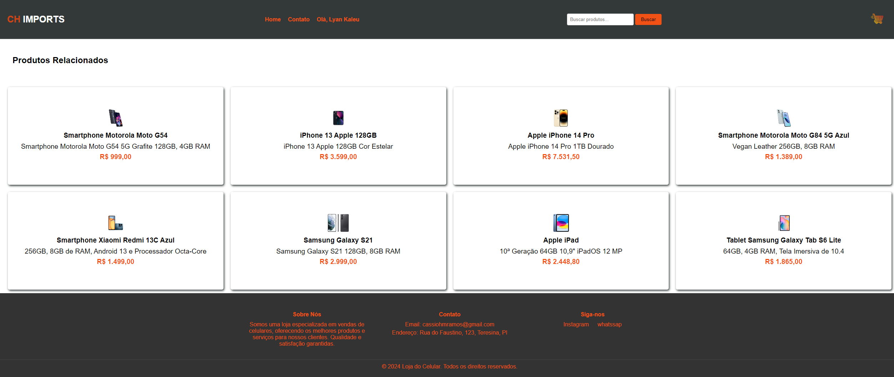

# E-Commerce

> This project is a complete e-commerce developed in HTML, CSS and Javascript, providing an intuitive shopping experience for smartphones. With features including a login screen with validations, organized smartphone catalog, interactive shopping cart, and detailed pages for each product, users can browse and purchase their favorite smartphones with ease.

### ♻️ Adjustments and improvements

The project is still under development and the next updates will focus on the following tasks:

- [ ] Responsive Design
- [ ] Input Validation
- [ ] Visual Feedback
- [ ] SEO
- [ ] Performance Optimization
- [ ] Regular Update

## 💻 Prerequisites

Before you begin, make sure you've met the following requirements:

- Web Browser: `<Google Chrome / Mozilla Firefox / Safari / Microsoft Edge>`, to view and interact with your website.
- Git (optional): This will allow you to clone the GitHub repository to your local machine.

## 🚀 Visiting e-commerce

To visit <e-commerce>, simply access this [link]()

## 📫 Contributing to e-commerce

To contribute to e-commerce, follow these steps:

1. Fork this repository.
2. Create a branch: `git checkout -b <branch_name>`.
3. Make your changes and commit them: `git commit -m '<mensagem_commit>'`
4. Push to the original branch: `git push origin <project_name> / <location>`
5. Create the pull request.

Alternatively, see the GitHub documentation at [how to create a pull request](https://help.github.com/en/github/collaborating-with-issues-and-pull-requests/creating-a-pull-request).

## 🤝 Collaborators

I would like to thank the following person, for being a fellow extension worker throughout the course project: "Web Development in HTML5, CSS, Javascript and PHP", who contributed to this project:

<table>
  <tr>
    <td align="center">
      <a href="https://www.instagram.com/cassioo__henrique/" title="Instagram do Cássio Henrique">
         
        
          <b>Cássio Henrique</b>
        
      </a>
    </td>
</table>

## 📝 License

This project is under license. See the [LICENSE](LICENSE) file for more details.
